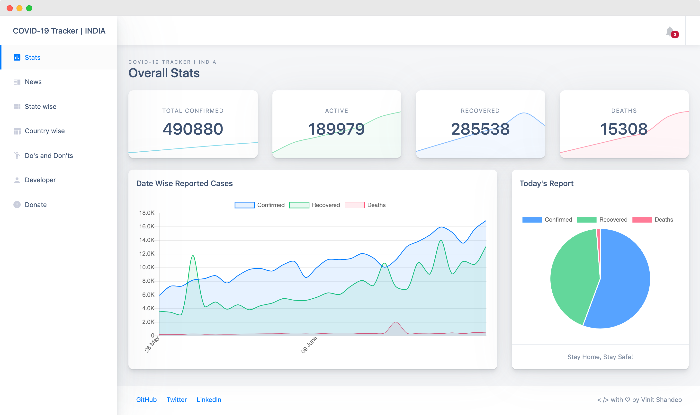

<p align="center">
    <a href="https://graphql.org/"></a>
    <br>
    <a href="https://vinitshahdeo.github.io/COVID19/"></a>
 </p>
 <h1 align="center"> <a href="https://vinitshahdeo.github.io/COVID19/">COVID-19</a> 🦠 API<sup>:mask:</sup> </h1>
 <p align="center">
    <a href="https://github.com/vinitshahdeo/covid19api/blob/master/LICENSE">
    </a> 
    <a href="https://app.netlify.com/sites/indiafightscorona/deploys">
    
    </a> 
    <a href="https://github.com/NovelCOVID/awesome-novelcovid"></a>
    <a href="https://github.com/vinitshahdeo/COVID19/"></a>
 </p>
 <h2 align="center">A <a href="https://graphql.org/">GraphQL</a> Express Server powered by @covid19india/<a
    href="https://github.com/covid19india/api">api</a> to provide COVID-19 related stats for India :india: 
 </h2>
 <h3 align="center"><a href="http://corona-cases-india.netlify.com/">COVID-19 Tracker</a> ღ <a href="https://indiafightscorona.netlify.app/">Dashboard</a></h3>
 <p align="center">
    
 </p>
 <p align="center">
    <a href="https://indiafightscorona.netlify.app/">
    
    </a>
 </p>
 <p align="center">
    <a href="https://www.producthunt.com/posts/covid-19-tracker-india?utm_source=badge-featured&utm_medium=badge&utm_souce=badge-covid-19-tracker-india"
       target="_blank">
       
      </a>
 </p>

## Setup

```bash
npm install && npm start
```
### Steps Explained

- Open terminal and run `npm install`

- Run `npm start`

- Open browser and go to `http://localhost:8080/graphql`

- Type the [queries](#queries) and enjoy! :smile:

- Run `npm run server` for local development


## Queries

#### `GET` overall COVID-19 stats

```graphql
{ 
  total {
    active
    confirmed
    deaths
    recovered
  }
}
```

#### `GET` statewise COVID-19 stats

```graphql
{
  statewise {
    state
    active
    confirmed
    deaths
    recovered
  }
}
```

#### `GET` datewise COVID-19 stats

```graphql
{
  datewise {
    date
    dailyconfirmed
    dailydeceased
    dailyrecovered
  }
}

```
## Dependencies Used

- [express](https://www.npmjs.com/package/express): A web application framework for [Node.js](https://nodejs.org/)

- [graphql](https://www.npmjs.com/package/graphql): The JavaScript reference implementation for [GraphQL](https://graphql.org/)

- [express-graphql](https://www.npmjs.com/package/express-graphql): A GraphQL HTTP Server middleware

## Related Work

- [COVID-19 Tracker - INDIA](http://corona-cases-india.netlify.com/) - A React App with the following features:
    - Graphs showing daily **confirmed**, **recovered** and **deceased** cases
    - **State-wise** report presented in Map of India
    - Tabular data for global corona cases
    - **Latest news** about COVID-19
    - Additional resources such as symptoms, precautions etc.

- [India Fights Corona -  Get current COVID-19 stats](https://indiafightscorona.netlify.app/)!


## Leave a :star:


Check out **@vinitshahdeo/[COVID19](https://github.com/Ajeetsoni2002/Covid-tracker)** repository. **Consider leaving a star!** :heart: :hugs:


